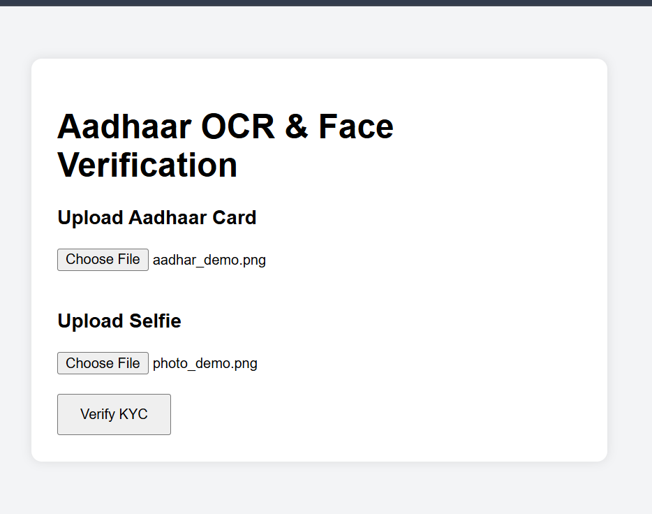
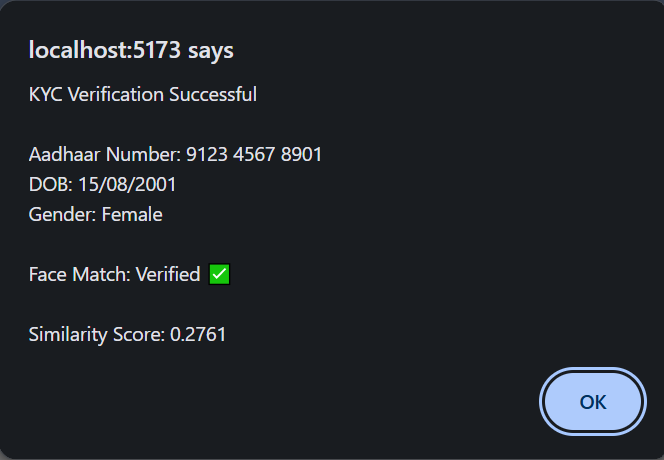

# Aadhaar OCR & Face Verification System

## Overview

A full-stack KYC verification system that extracts Aadhaar details using OCR and verifies user identity through facial recognition.

The application allows users to:

* Upload an Aadhaar card image
* Extract Aadhaar Number, DOB, and Gender using OCR
* Upload a selfie image
* Compare the Aadhaar photo with the uploaded selfie
* Return verification results with a similarity score

---

## Features

* OCR-based Aadhaar data extraction
* Face detection using Face-api.js
* Face similarity matching
* Aadhaar Number extraction
* DOB extraction
* Gender extraction
* Real-time KYC verification results
* Full-stack React + Node.js application

---

## Tech Stack

### Frontend

* React.js
* Axios

### Backend

* Node.js
* Express.js
* Multer

### AI / ML Libraries

* Tesseract.js
* Face-api.js
* TensorFlow.js

### Image Processing

* Sharp

---

## Application Interface



---

## Verification Result



---

## Project Structure

```text
aadhaar-kyc-system
│
├── backend
│   ├── models
│   ├── routes
│   ├── uploads
│   ├── faceService.js
│   └── server.js
│
├── frontend
│   ├── src
│   └── public
│
├── screenshots
│   ├── upload.png
│   └── verif.png
│
└── README.md
```

## Installation

### Clone Repository

```bash
git clone https://github.com/Hibza-Kudari/aadhaar-kyc-system.git
cd aadhaar-kyc-system
```

### Backend Setup

```bash
cd backend
npm install
node server.js
```

### Frontend Setup

```bash
cd frontend
npm install
npm run dev
```

---

## Output Example

```json
{
  "aadhaarNumber": "XXXX YYYY ZZZZ",
  "dob": "DD/MM/YYYY",
  "gender": "Female",
  "faceMatch": true,
  "distance": "0.6477"
}
```

---

## Future Improvements

* Aadhaar photo cropping before matching
* Confidence score visualization
* Better UI with Tailwind CSS
* Database integration
* Cloud deployment
* Multi-document KYC support

---

## Author

**Hibza Kudari**

Built as a full-stack AI-powered KYC verification project using OCR and facial recognition technologies.
